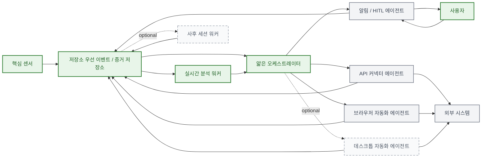

# 초기 아키텍처

## 한눈에 보기
- 이 구조의 핵심은 `센서 -> 저장소 -> 실시간 분석 -> 오케스트레이터`다.
- 액션 계층은 중요하지만, 제품 차별화의 중심은 아니다.
- 모든 실행은 `오케스트레이터`를 통과한다.
- 사용자 개입은 `알림 / HITL 에이전트`를 통해서만 들어온다.
- v1에서 `사후 세션 워커`, `데스크톱 자동화 에이전트`는 옵션이다.

## 설계 원칙
- `store-first`: 센서는 먼저 증거와 이벤트를 저장한다.
- `orchestrator-controlled`: 실행은 오케스트레이터가 통제한다.
- `human-in-the-loop`: 승인, 질문, 응답은 별도 상호작용 노드로 처리한다.
- `macOS-first`: v1은 macOS 기준으로 설계한다.
- `approval-first`: 외부 변경이 있는 액션은 기본적으로 사용자 승인을 요구한다.

## 심플 다이어그램

색상 의미:
- 초록: 핵심 차별화 영역
- 실선 회색: 일반 실행 구성요소
- 점선 회색: 옵션 구성요소

## 핵심 흐름
1. `핵심 센서`가 로컬 사용자 활동을 관측하고 저장소에 기록한다.
2. `실시간 분석 워커`가 최근 이벤트를 읽고 지금 무슨 일이 일어나는지 해석한다.
3. `얇은 오케스트레이터`가 제안된 액션을 읽고 정책, 우선순위, 승인 여부를 판단한다.
4. 승인된 작업만 액션 에이전트로 전달된다.
5. `알림 / HITL 에이전트`가 사용자와 상호작용하고, 그 응답은 다시 저장소로 기록된다.
6. 옵션으로 `사후 세션 워커`가 세션 종료 후 요약과 메모리 축적을 수행한다.

## 노드별 설명

### 1. 핵심 센서
한 줄 설명:
- 시스템의 입력 계층이다.

하는 일:
- 로컬 머신에서 사용자 활동을 관측한다.
- 원본 증거와 저수준 이벤트를 수집한다.
- 분석이 가능할 정도로만 1차 정규화한다.
- 저장소에 직접 기록한다.

하지 않는 일:
- 액션을 직접 실행하지 않는다.
- 승인 여부를 판단하지 않는다.
- 사용자에게 직접 제안하지 않는다.

v1 포함 범위:
- 윈도우/앱 센서
- 브라우저 컨텍스트 센서
- 접근성 센서
- 화면 캡처 센서
- OCR 인터프리터
- 파일 센서
- 입력 의미 센서

### 2. 저장소 우선 이벤트 / 증거 저장소
한 줄 설명:
- 시스템의 단일 사실원천이다.

하는 일:
- 센서가 수집한 원본 증거를 저장한다.
- 정규화된 이벤트를 저장한다.
- 사용자 응답, 액션 결과, 오케스트레이션 결과를 저장한다.
- 나중에 재분석할 수 있는 근거 저장소 역할을 한다.

왜 필요한가:
- 센서와 추론을 분리할 수 있다.
- 데이터 유실을 줄일 수 있다.
- 분석 로직이 바뀌어도 다시 돌려볼 수 있다.

대표 데이터:
- `raw evidence`
- `normalized events`
- `session graph`
- `proposed actions`
- `action log`
- `memory / knowledge entries`

### 3. 실시간 분석 워커
한 줄 설명:
- 최근 신호를 읽고 지금 상황에 대한 짧은 가설을 만든다.

하는 일:
- 최신 증거와 이벤트를 읽는다.
- 짧은 컨텍스트 윈도우를 만든다.
- 세션 시작, 진행, 종료 후보를 찾는다.
- 현재 작업과 단계(task/phase)를 추론한다.
- `proposed_action`을 생성한다.

하지 않는 일:
- 외부 도구를 직접 실행하지 않는다.
- 최종 승인 결정을 하지 않는다.
- 긴 회고성 요약을 만들지 않는다.

핵심 출력:
- `session hint`
- `task / phase hypothesis`
- `proposed action`

### 4. 사후 세션 워커
한 줄 설명:
- 세션 종료 후 뒤늦게 더 깊게 해석하는 계층이다.

하는 일:
- 종료된 세션을 더 넓은 컨텍스트로 복원한다.
- 세션 요약을 만든다.
- tacit knowledge 후보를 추출한다.
- 재사용 가능한 메모리를 저장한다.

왜 옵션인가:
- PoC는 실시간 보조만으로도 1차 검증이 가능하다.
- 사후 학습은 품질을 높이지만 첫 번째 인터랙션 루프에 필수는 아니다.

### 5. 얇은 오케스트레이터
한 줄 설명:
- 시스템의 제어 평면이다.

하는 일:
- 활성 세션 상태를 유지한다.
- 제안된 액션을 읽고 우선순위를 정한다.
- `approval-first` 정책을 강제한다.
- 중복 액션을 제거한다.
- 실제 액션 에이전트로 작업을 dispatch한다.

하지 않는 일:
- 원본 센싱을 하지 않는다.
- 큰 컨텍스트를 들고 계속 장문 추론하지 않는다.
- 사용자 인터페이스를 직접 담당하지 않는다.

설계 의도:
- 최대한 결정론적으로 동작한다.
- 정책과 실행 통제에 집중한다.
- 거대한 단일 에이전트가 되지 않도록 얇게 유지한다.

### 6. 알림 / HITL 에이전트
한 줄 설명:
- 사용자와 시스템 사이의 단일 상호작용 창구다.

하는 일:
- 제안을 보여준다.
- 짧은 추가 질문을 한다.
- 위험한 액션에 대한 승인을 요청한다.
- 실행 결과를 사용자에게 보여준다.
- 사용자 응답을 다시 저장소에 기록한다.

왜 중요한가:
- human-in-the-loop 흐름이 명시적으로 분리된다.
- 사용자 상호작용이 오케스트레이션 로직과 섞이지 않는다.

### 7. API 커넥터 에이전트
한 줄 설명:
- 공식 서비스 API를 사용하는 가장 안정적인 실행기다.

하는 일:
- 연결된 SaaS의 데이터를 읽고 생성하고 수정한다.
- 가능한 경우 API 경로를 우선 사용한다.
- 실행 결과와 실패 원인을 저장소에 기록한다.

왜 일반 구성인가:
- 중요하지만 제품 차별화의 핵심은 아니다.
- 실행 방식 자체는 비교적 결정론적이다.

대표 대상:
- Notion
- Linear
- Slack
- Gmail

### 8. 브라우저 자동화 에이전트
한 줄 설명:
- API로 커버되지 않는 웹 워크플로우를 처리하는 fallback 실행기다.

하는 일:
- 웹 페이지를 탐색한다.
- 웹앱에서 정보를 수집한다.
- 초안 작성이나 폼 입력을 수행한다.
- 커넥터가 없을 때 대체 실행 경로가 된다.

실행 특성:
- 오케스트레이터가 발급한 작업만 수행한다.
- API 경로보다 불안정할 수 있다.
- 확신이 낮으면 `draft`, `deep-link`, `HITL`로 강등한다.

### 9. 데스크톱 자동화 에이전트
한 줄 설명:
- 네이티브 앱 조작이 필요할 때 쓰는 최후 fallback 실행기다.

하는 일:
- 브라우저나 API 경로가 부족할 때 네이티브 앱과 상호작용한다.
- 창 포커스, 메뉴 액션, 커서/키보드 기반 조작을 수행한다.

왜 옵션인가:
- 권한 비용이 크다.
- 안정성 리스크가 높다.
- 신뢰와 UX 부담이 더 크다.

### 10. 사용자
한 줄 설명:
- 결과를 받는 대상이 아니라 루프 안의 참여자다.

사용자 역할:
- 액션을 승인하거나 거절한다.
- 추가 질문에 답한다.
- 자동화 확신이 낮을 때 빠진 컨텍스트를 보완한다.

설계상 의미:
- 사용자 개입은 항상 명시적이어야 한다.
- 모든 상호작용은 추적 가능해야 한다.

### 11. 외부 시스템
한 줄 설명:
- 액션 에이전트가 실제로 조작하는 대상이다.

예시:
- API가 있는 SaaS 제품
- 브라우저 기반 워크플로우
- 네이티브 애플리케이션

설계상 의미:
- 오케스트레이터 신뢰 경계 밖에 있다.
- 외부 변경은 모두 기록 가능해야 한다.

## 핵심 / 일반 / 옵션 구분
`Core`
- 핵심 센서
- 저장소 우선 이벤트 / 증거 저장소
- 실시간 분석 워커
- 얇은 오케스트레이터
- 사용자 상호작용 루프

`Standard`
- 알림 / HITL 에이전트
- API 커넥터 에이전트
- 브라우저 자동화 에이전트

`Optional`
- 사후 세션 워커
- 데스크톱 자동화 에이전트

## 이후 상세 설계에서 정할 것
- evidence, events, sessions, proposed actions의 정확한 저장 스키마
- action proposal과 dispatch에 사용할 confidence threshold
- v1에서 우선 붙일 first-party API connector 범위
- 첫 PoC에서 사후 학습을 활성화할지 여부
