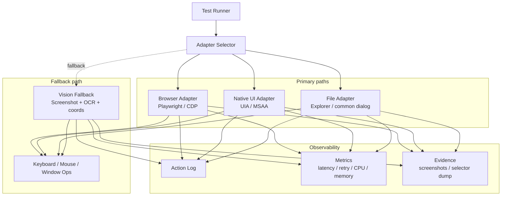

# Windows 제어 레이어 기술 검증 문서

## 문서 목적
- 이 문서의 목적: `제품 아키텍처 설계`가 아니라 `Windows 제어 가능성 검증`
- 이번 단계의 핵심 질문:
  - Windows에서 브라우저, 파일, 기본 앱, 일부 업무 앱 제어 가능 여부
  - 중·저사양 Windows에서 실용적인 수준의 latency와 안정성 확보 가능 여부
  - 어떤 제어 방식이 주 경로가 되고, 어떤 방식이 fallback이 되는지
  - 레퍼런스 제품들이 이 문제를 어떤 기술 구조로 푸는지

## 이번 단계에서 답해야 할 질문
1. Windows에서 구조적 제어가 실제로 되는 앱 범위
2. 구조적 제어가 안 되는 경우 vision fallback의 실용성
3. 저사양 장비에서의 CPU / 메모리 / latency 수준
4. `브라우저`, `파일`, `기본 앱`, `업무 앱`별 성공률 차이
5. v1에 포함 가능한 범위와 제외해야 할 범위

## 이번 단계의 목표와 비목표

### 목표
- `된다 / 안 된다`를 문장으로 주장하는 대신 실험으로 확인
- 앱 종류별 제어 가능 범위 측정
- 구조적 경로와 vision fallback의 품질 차이 측정
- 저사양 Windows에서의 자원 사용량 측정
- v1 포함 / 조건부 포함 / 제외 판단 기준 확보

### 비목표
- 전체 제품 아키텍처 구현
- 고도화된 오케스트레이션 구현
- 장시간 자율 실행
- 제품 UX 설계

## 현재 가설
- 브라우저는 `Playwright / CDP` 기반 구조적 제어가 주 경로
- 파일 탐색기와 기본 Windows 앱은 `UI Automation (UIA)` 기반 구조적 제어가 주 경로
- 구조적 경로가 실패할 때만 `screenshot + OCR + 좌표 기반 조작` fallback 사용
- 저사양 Windows에서는 `상시 vision loop`보다 `selector-first` 구조가 현실적
- Notion Desktop, Excel Desktop, custom-rendered 앱은 앱별 편차가 큼

## 제어 레이어 가설 아키텍처

## 왜 이 구조를 가정하나

### 1. Browser Adapter
- 브라우저는 화면 좌표보다 DOM / locator / role 기반 제어가 훨씬 안정적
- 브라우저 제어는 이미 상용/오픈소스 모두 `CDP / Playwright` 계열 구조 채택
- Notion, Slack, 사내 웹툴은 Desktop 앱보다 Web 경로가 먼저 검토 대상

### 2. Native UI Adapter
- Windows 네이티브 앱은 `UIA`가 가장 현실적인 구조적 제어 경로
- File Explorer, Notepad, common dialog 같은 표준 UI에서 특히 유리
- 다만 앱마다 UIA 노출 수준 편차 존재

### 3. Vision Fallback
- 구조적 selector가 없거나 깨질 때를 위한 최후 fallback
- 범용성은 높지만 latency와 안정성은 낮은 편
- 저사양 장비에서는 상시 루프보다 `selective screenshot`만 허용하는 방향이 현실적

## 레퍼런스 조사 요약

### 1. Playwright / CDP
- 관찰:
  - browser context / persistent context 기반 분리된 세션 운용 가능
  - DOM / role / locator 기반 조작
- 시사점:
  - 브라우저는 vision보다 구조적 제어 우선
  - 브라우저 제어는 비교적 검증된 영역

### 2. Microsoft UI Automation
- 관찰:
  - Windows 데스크톱 앱 접근을 위한 공식 프레임워크
  - Power Automate도 desktop UI elements를 UIA 중심으로 사용
- 시사점:
  - Windows 기본 앱과 표준 컨트롤은 구조적 제어 가능성 높음
  - 앱별 노출 품질 차이가 핵심 변수

### 3. Power Automate Desktop
- 관찰:
  - desktop selector와 web selector를 분리
  - 구조적 selector 우선, 실패 시 self-heal / 보조 탐색
- 시사점:
  - 브라우저와 네이티브를 같은 방식으로 다루지 않음
  - selector-first 구조가 상용 레퍼런스의 기본 패턴

### 4. Anthropic / OpenAI Computer Use
- 관찰:
  - screenshot -> reasoning -> mouse/keyboard 반복 루프
  - 범용성은 높지만 latency와 reliability 한계 존재
- 시사점:
  - vision-only는 fallback으로는 유효
  - 주 경로로 쓰기에는 아직 실용성 검증 필요

### 5. OpenClaw
- 관찰:
  - browser profile 분리, sandbox, 도구 정책 강화
  - Windows native 제어보다는 격리와 브라우저 운영에 강점
- 시사점:
  - 참고 포인트는 Windows 제어보다 `trust boundary`

### 6. screenpipe
- 관찰:
  - event-driven capture
  - accessibility-first, OCR-fallback
  - local-first evidence store
- 시사점:
  - 제어 기술 레퍼런스라기보다 `관측 비용`과 `근거 저장` 레퍼런스

## 타깃별 기술 판단

| 대상 | 주 경로 | 보조 경로 | 예상 난이도 | 현재 판단 |
| --- | --- | --- | --- | --- |
| Chrome / Edge | Playwright / CDP | Vision fallback | 낮음 | 적극 검증 |
| File Explorer | UIA | Keyboard / Vision fallback | 낮음~중간 | 적극 검증 |
| Common File Dialog | UIA | Keyboard | 중간 | 적극 검증 |
| Notepad | UIA / Win32 | Keyboard | 낮음 | 적극 검증 |
| Calculator | UIA | Vision fallback | 낮음 | 보조 검증 |
| Notion Web | Playwright / CDP | Vision fallback | 중간 | 적극 검증 |
| Excel Desktop | UIA custom patterns + keyboard | Vision fallback | 중간~높음 | 조건부 검증 |
| Notion Desktop | UIA 노출 시 selector, 아니면 vision | Vision fallback | 높음 | 조건부 검증 |
| Canvas / custom-render app | Vision fallback | Keyboard | 매우 높음 | v1 제외 후보 |

## 예상 한계

### 1. 앱별 접근성 편차
- Win32 / WPF / WinForms / Electron / canvas 계열별 차이
- 같은 Electron이어도 accessibility 노출 수준 편차
- selector 안정성의 앱별 차이

### 2. 저사양 장비 성능 문제
- screenshot + OCR 루프의 CPU 부담
- foreground window 전환 지연
- 고DPI / 다중 모니터 / scaling 이슈

### 3. 상태 기반 불안정성
- 로그인 상태
- 파일 dialog 타이밍
- 창 제목 변경
- 앱 재시작 후 재attach

### 4. 구조적 경로 부재
- canvas 기반 편집기
- custom-drawn controls
- automation id / name이 부실한 앱

## 실험 장비
- 저사양 Windows 실기기 1대 필수
- 권장 최소 사양:
  - 8GB RAM
  - 내장 그래픽
  - SSD
  - 단일 모니터
  - 1080p 또는 125% DPI
- VM만으로 부족한 이유:
  - 실제 foreground 전환 품질 확인 한계
  - input injection timing 편차
  - Explorer / dialog / DPI 동작 차이

## 실험 방식

### 1단계. Capability Probe
- 앱 attach 가능 여부
- top-level window 탐지 가능 여부
- UIA tree 조회 가능 여부
- 지원 control pattern 확인
- selector 안정성 확인
- common dialog attach 가능 여부

### 2단계. Deterministic Scenario

#### 브라우저
- 특정 URL 열기
- 검색
- 입력 필드에 텍스트 입력
- 결과 텍스트 읽기

#### 파일 탐색기
- 다운로드 폴더 진입
- 최근 파일 찾기
- 열기
- 다른 이름으로 저장

#### 기본 앱
- Notepad 실행
- 텍스트 입력
- 저장
- 닫기

#### 업무 앱
- Notion Web 페이지 열기
- 간단 텍스트 읽기 / 입력
- Excel Desktop 파일 열기
- 지정 셀 읽기 / 쓰기 / 저장

### 3단계. Failure / Degrade Scenario
- 앱 재실행 후 재attach
- 창 제목 변경
- 125% / 150% DPI
- CPU contention 상황
- selector miss 후 재조회
- selector 실패 후 vision fallback 1회

## 측정 항목
- scenario success rate
- step success rate
- first-run success rate
- p50 / p95 latency
- retry 횟수
- selector 기반 성공률
- vision fallback 진입 비율
- CPU 사용량
- 메모리 사용량
- foreground app 전환 실패율

## 실험 산출물
- 앱별 capability probe 결과
- scenario별 성공 / 실패 표
- step latency 표
- CPU / memory 측정치
- selector dump
- evidence screenshot
- `가능 / 조건부 가능 / 제외` 판정표

## 1차 합격 기준
- Chrome / Edge 시나리오 안정 동작
- File Explorer + common dialog 시나리오 안정 동작
- Notepad 시나리오 안정 동작
- 평균 step latency `1~2초대`
- 저사양 장비에서 과도한 idle 자원 점유 없음
- vision fallback이 주 경로가 아니라 예외 경로일 것

## 실패 시 해석 기준
- 브라우저가 안 되면: 제어 레이어 구조 자체 재검토 필요
- Explorer / dialog가 불안정하면: 파일 adapter 우선 전략 재검토 필요
- Notion Desktop만 불안정하면: desktop app 자체 문제로 분리, Web 우선 유지
- Excel complex flow만 불안정하면: 단순 read/write 범위로 축소 가능
- vision fallback 비중이 높으면: v1 범위를 구조적 제어 가능한 앱으로 제한 필요

## 이번 단계에서 기대하는 결론 형태
- `Windows에서는 된다` 같은 문장형 결론이 아니라 아래 형태의 결과
  - 어떤 앱이 어떤 경로로 제어 가능한지
  - 어떤 앱이 fallback에 크게 의존하는지
  - 어떤 앱은 v1 범위에서 제외해야 하는지
  - 저사양 장비에서 병목이 무엇인지

## 바로 다음 액션
1. `Browser / Native UI / File` 3개 adapter만 있는 최소 러너 제작
2. Probe 스크립트 작성
3. 실기기에서 deterministic scenario 실행
4. 수치와 실패 케이스 수집
5. 결과 기반 v1 범위 확정

## 참고 자료
- [Playwright BrowserType.launchPersistentContext](https://playwright.dev/docs/api/class-browsertype)
- [Playwright Browser Context isolation](https://playwright.dev/docs/next/browser-contexts)
- [Microsoft UI Automation overview](https://learn.microsoft.com/en-us/windows/win32/winauto/entry-uiauto-win32)
- [UI Automation samples](https://learn.microsoft.com/en-us/windows/win32/winauto/samples-entry)
- [Win32: Some frameworks do not support UI Automation](https://learn.microsoft.com/en-us/accessibility-tools-docs/items/win32/frameworkdoesnotsupportuiautomation)
- [Excel custom patterns](https://learn.microsoft.com/en-us/office/uia/excel/excelcustompatterns)
- [Power Automate desktop automation](https://learn.microsoft.com/en-us/power-automate/desktop-flows/desktop-automation)
- [Power Automate UI elements](https://learn.microsoft.com/en-us/power-automate/desktop-flows/ui-elements)
- [Power Automate self-heal UI/browser automation](https://learn.microsoft.com/en-us/power-platform/release-plan/2024wave2/power-automate/self-heal-ui-browser-automation-actions-at-execution-ai)
- [Appium Windows Driver](https://github.com/appium/appium-windows-driver)
- [WinAppDriver](https://github.com/microsoft/WinAppDriver)
- [FlaUI](https://github.com/FlaUI/FlaUI)
- [pywinauto](https://github.com/pywinauto/pywinauto)
- [Anthropic computer use tool](https://platform.claude.com/docs/en/agents-and-tools/tool-use/computer-use-tool)
- [OpenAI computer use](https://developers.openai.com/api/docs/guides/tools-computer-use)
- [OpenClaw browser tool](https://docs.openclaw.ai/tools/browser)
- [OpenClaw sandboxing](https://docs.openclaw.ai/sandboxing)
- [OpenClaw Windows](https://docs.openclaw.ai/windows)
- [screenpipe architecture](https://docs.screenpi.pe/architecture)
- [screenpipe FAQ](https://docs.screenpi.pe/faq)
